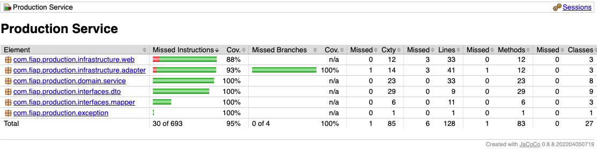

# Tech Challenge Phase 4
Pos Tech FIAP - Production Project

## Team Members
- Gabriel Martins de Miranda - rm352234
- Thiago Merino Rodrigues Barbosa - rm351475
- Guilherme Mazzei Graf - rm351411
- Erich Nelson Silveira Pinton - rm351414

## Documentation

### Test Coverage Report

### DDD
- https://miro.com/app/board/uXjVNf1J6J8=

### Postman Collection
- [Postech.Production.postman_collection.json](docs/PosTech.Product.postman_collection.json) inside `docs` directory

### Swagger (openAPI)
- Access [Swagger](http://localhost:8080/swagger-ui/index.html) UI

## Dependencies
- Open JDK 17 - Recommended: [Amazon Corretto](https://docs.aws.amazon.com/corretto/latest/corretto-17-ug/downloads-list.html)
- [Docker](https://docs.docker.com/get-docker/)

## Running in k8s
- Check [makefile](./makefile) for commands

## Running in docker
- To start: `docker-compose up -d`
- To stop: `docker compose down`
- Database is maintained in volume

## Running locally
- Build the project: `mvn clean install -DskipTests`
- Run it in your IDE

## Verify coverage
- Build the project: `mvn verify`
